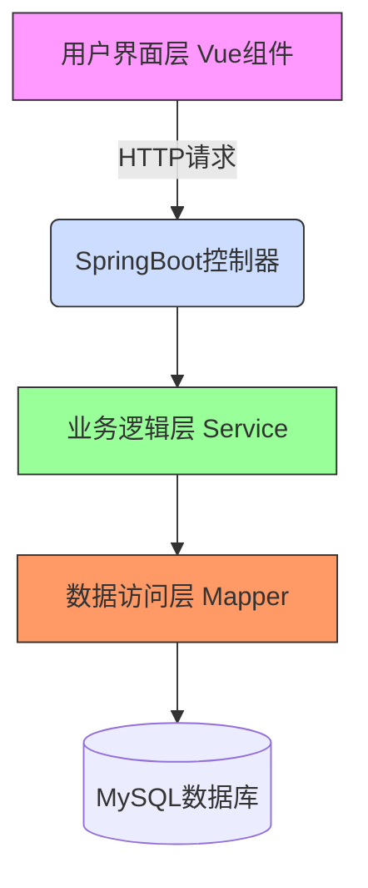
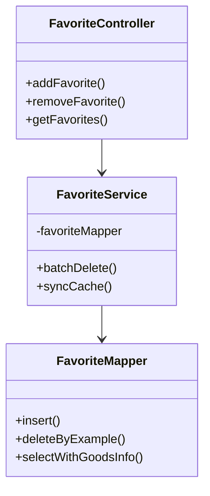
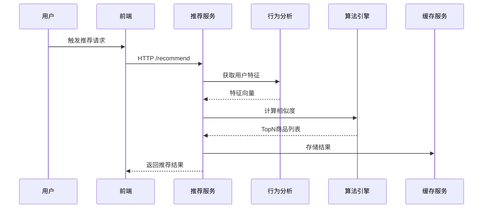

# 商品推荐系统毕业论文内容框架

## 1. 系统架构设计
### 1.1 技术栈组成
- 前端：Vue3 + ElementPlus + Vite
- 后端：SpringBoot 2.7.0 + MyBatis 3.5.9
- 数据库：MySQL 8.0 + HikariCP连接池
- 中间件：PageHelper分页组件

### 1.2 分层架构图


## 2. 核心算法实现
### 2.1 协同过滤算法
```java
// 用户相似度计算（后端Java实现片段）
public double calculateUserSimilarity(User u1, User u2) {
    Map<Long, Double> u1History = getUserBehaviorWeights(u1.getId());
    Map<Long, Double> u2History = getUserBehaviorWeights(u2.getId());
    
    // 余弦相似度公式：
// $$
// sim(u,v) = \frac{\sum_{i\in I_{uv}} w_{u_i} \cdot w_{v_i}}{\sqrt{\sum_{i\in I_u} w_{u_i}^2} \cdot \sqrt{\sum_{i\in I_v} w_{v_i}^2}}
// $$
// 其中$I_{uv}$表示用户u和v的共同行为商品集合
    return cosineSimilarity(u1History, u2History);
}
```

### 2.2 行为权重计算逻辑
| 行为类型 | 权重系数 | 衰减因子 |
|---------|---------|---------|
| 浏览    | 0.6     | 0.95/天 |
| 收藏    | 0.8     | 0.98/天 |
| 购买    | 1.0     | 1.0     |

## 3. 功能模块说明

### 3.3 收藏管理模块（FavoriteManagement.vue）

### 3.1 浏览记录模块（BrowsingHistory.vue）
- **组件功能**：实现浏览记录的CRUD操作
- **关键技术点**：
  - ElementPlus表格组件与分页联动
  - Axios异步请求封装
  - 本地时间格式化处理

### 3.2 推荐系统模块
- 实时推荐接口：`/api/recommend/real-time`
- 离线推荐接口：`/api/recommend/offline`

## 4. 测试验证方案

### 4.3 JMeter压力测试方案
```
测试计划
├─ 线程组 (并发用户数：100)
│  ├─ HTTP请求：/api/recommend/real-time
│  ├─ 响应断言
│  └─ 聚合报告
├─ 监听器
│  ├─ 响应时间图
│  └─ 吞吐量监控

关键指标：
- 平均响应时间 < 500ms
- 错误率 < 0.1%
- 吞吐量 > 200 req/s
```

### 4.4 推荐流程时序图

### 4.1 接口测试用例
```java
@SpringBootTest
class BrowseControllerTest {
    @Test
    void testClearHistory() {
        // 测试清空接口（具体实现需补充）
        mockMvc.perform(delete("/api/browse/clear"))
               .andExpect(status().isOk());
    }
}
```

### 4.2 UI自动化测试方案
1. 使用Cypress进行组件测试
2. 关键测试场景：
   - 表格筛选功能验证
   - 批量操作完整性测试
   - 分页组件边界测试

> 注：需补充架构图、类图等可视化内容